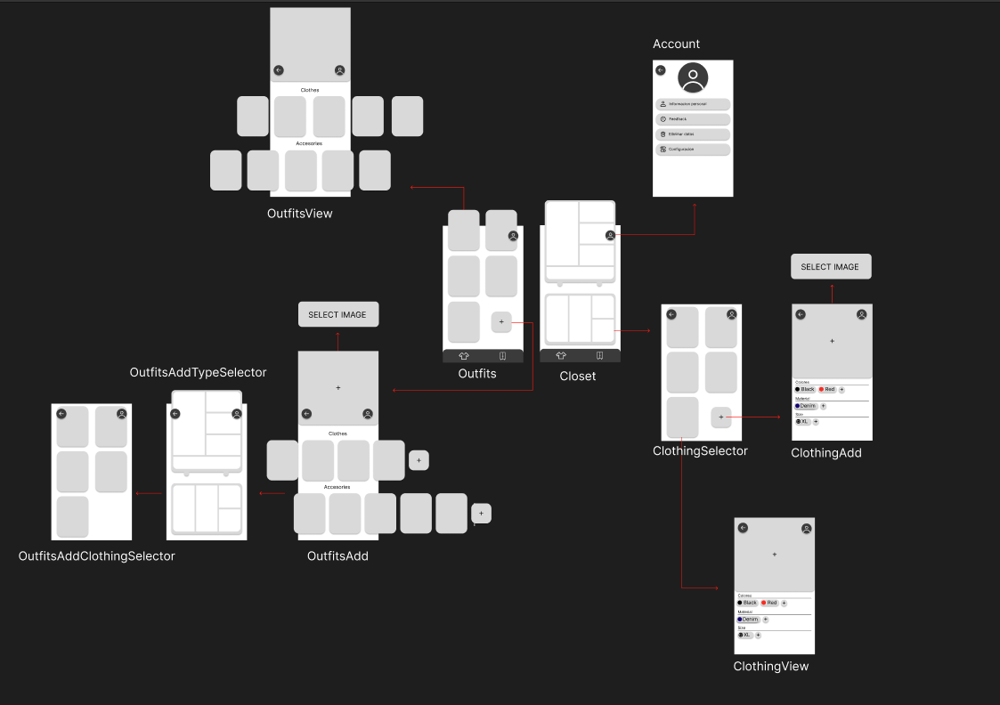
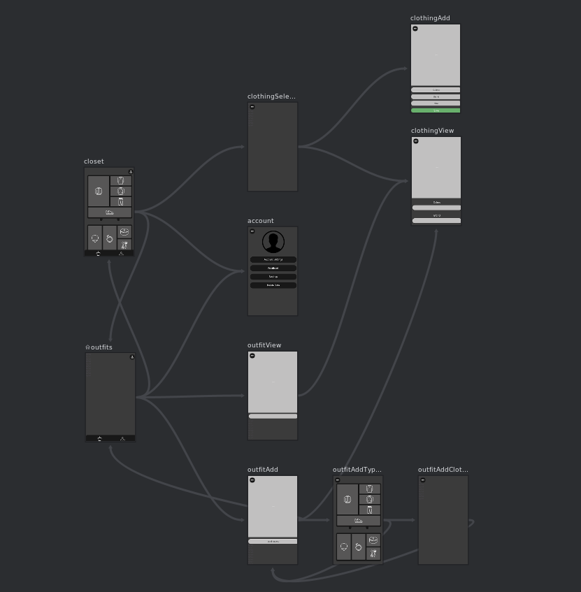

# Diseño 

1. **Closet (Pantalla Principal):**
   - Funciona como el punto de acceso principal.
   - Opciones disponibles:
     - Visualizar toda la ropa.
     - Crear y gestionar outfits.
     - Acceder al perfil del usuario.

2. **Account (Cuenta):**
   - Por ahora esta de decoracion pero se le añadiran funciones en versiones futuras

3. **Clothing Add (Añadir Prenda):**
   - Permite agregar nuevas prendas al guardarropa.
   - Los campos incluyen nombre, tipo y colores.

4. **Clothing View (Ver Prenda):**
   - Muestra los detalles de una prenda específica.
   - Opciones:
     - Eliminarla del guardarropa.

5. **Outfits:**
   - Lista y organiza todos los outfits creados.
   - Acceso a los detalles de cada prenda del conjunto.

6. **Outfit View (Ver Outfit):**
   - Presenta los detalles de un outfit guardado.
   - Permite eliminar la combinación.

7. **Outfit Add (Añadir Outfit):**
   - Proceso de creación de un nuevo outfit:
     1. Selección del tipo de outfit (casual, formal, deportivo, etc.).
     2. Agregación de prendas desde el guardarropa.

8. **Clothing Selection (Selección de Prendas):**
   - Herramienta para filtrar y elegir prendas específicas para añadir a un outfit.

## Navegación 

- La navegación entre pantallas es fluida e intuitiva, con transiciones lógicas desde la pantalla principal hacia las funciones específicas.

- Desde "Outfit Add" se accede a la selección de prendas, que actualiza automáticamente los archivos json de outfits.

